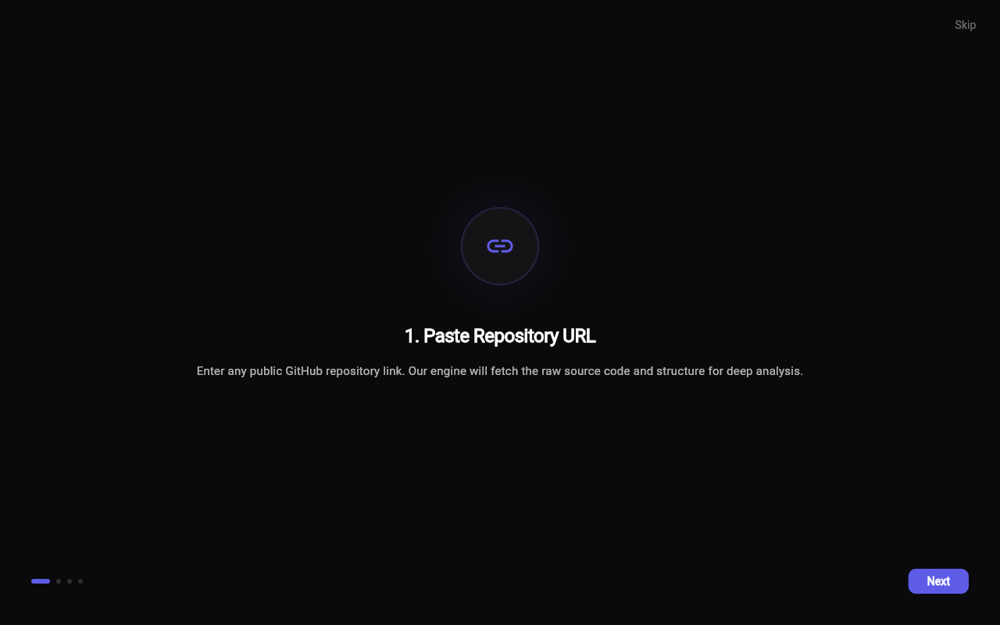
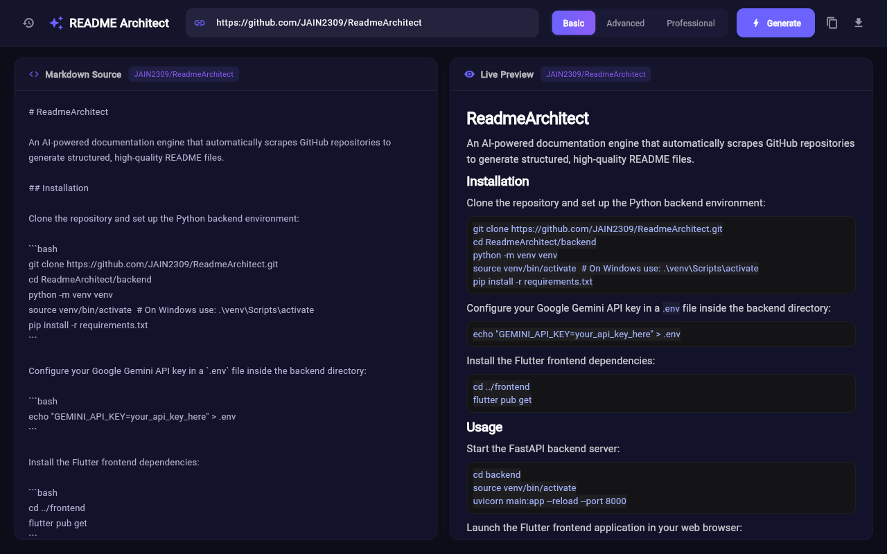
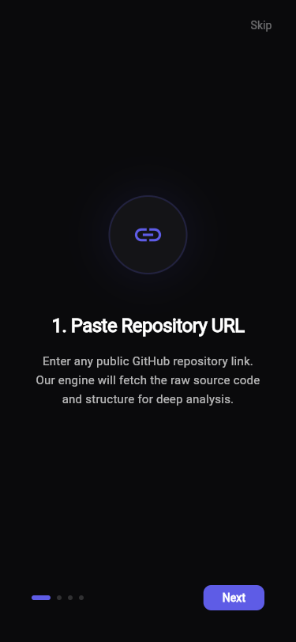
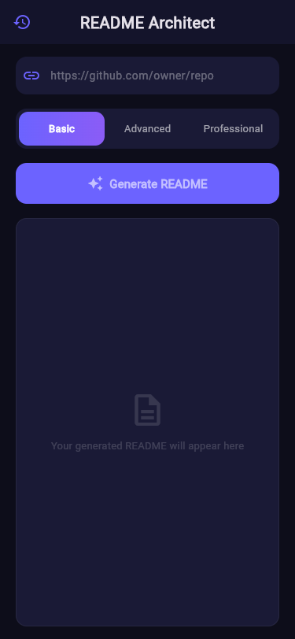
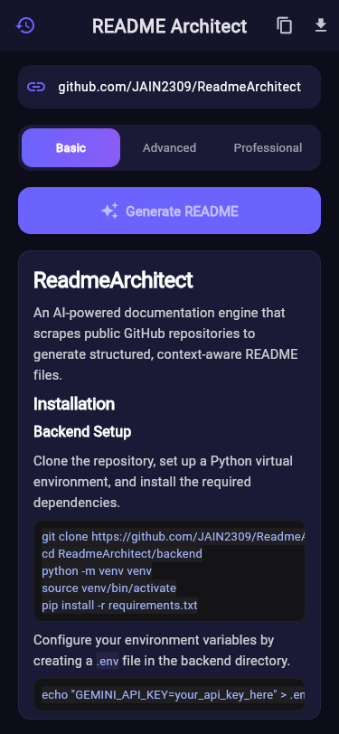

---

<div align="center">

A **production-grade AI documentation engine** connecting developers with automated, picture-perfect README generation — built with speed, intelligence, and modern design at its core.

<br/>


</div>

---

## 📑 Table of Contents
- [✨ Features](#-features)
- [📸 App Screenshots](#-app-screenshots)
- [🛠 Tech Stack](#-tech-stack)
- [📂 Project Structure](#-project-structure)
- [🚀 Getting Started](#-getting-started)
- [🧠 AI Architecture](#-ai-architecture)
- [🔌 API Endpoints](#-api-endpoints)
- [⭐ Presentation Modes](#-presentation-modes)
- [🧪 Testing](#-testing)

---

## ✨ Features
<table>
<tr>
<td width="33%" valign="top">

### 🤖 AI Engine (Backend)
- **Deep Source Scraping** via GitHub Trees API (recursive file tree)
- **Deep File Content Fetching** — downloads up to 5 key files (10k chars each) for richer AI context
- **Repo Metadata Extraction** — scrapes description, stars, license, primary language, and default branch
- Automatic detection of `package.json`, `main.py`, `pubspec.yaml`, `Dockerfile`, `Cargo.toml`, `go.mod`, and more
- **Context-Aware Inference** using Gemini 3.5 Flash
- Pinned temperature (`0.2`) for deterministic markdown output
- Graceful mock-tree fallback when GitHub API is rate-limited
- **GitHub URL Validation** via Pydantic field validators
- **In-Memory History Store** — saves all past generations with timestamps

</td>
<td width="33%" valign="top">

### 💻 Desktop/Web Frontend
- Sleek, side-by-side **split pane** layout
- Live monospace code editor view (raw markdown source)
- **Real-time Markdown Renderer** preview pane
- Smooth shimmer loading animations
- Collapsible **History Sidebar** with animated open/close
- One-click **copy** & `.md` **download** (browser file save)
- **Error banner** with inline dismiss button
- **Keyboard shortcut** — press Enter in the URL field to generate
- Color-coded **mode badges** (green / blue / amber) on history entries
- **Time-ago labels** on history entries (e.g., "2m ago", "1h ago")

</td>
<td width="33%" valign="top">

### 📱 Native Mobile Frontend
- Single-column, thumb-friendly vertical scroll layout
- Beautiful **Onboarding Guide Map** with glowing aesthetics (4-step walkthrough)
- **Drawer-based History Panel** accessible via AppBar icon
- **Pulsing empty-state animation** before first generation
- Styled error container with colored border
- Instant **clipboard fallback** if browser downloads aren't supported
- Delete individual history entries or **clear all** with confirmation dialog
- Mode selector with **animated gradient transitions**

</td>
</tr>
</table>

### 🎬 Shared Experience
- **Animated Splash Screen** — 6-stage staggered animation sequence:
  1. Icon entrance (scale + rotate with elastic overshoot)
  2. Shimmer sweep across icon
  3. Title slide-up with fade
  4. Subtitle fade-in
  5. Gradient progress bar fill
  6. Exit fade → navigate to onboarding
- **4-Step Interactive Onboarding** — Paste URL → Select Mode → Preview → Export/History
- **Responsive Platform Detection** — auto-routes to Mobile or Desktop layout based on runtime environment (native Android vs Chrome/Edge)

---

## 📸 App Screenshots

### 🖥️ Desktop / Web Dashboard
<p align="center">
  
  
</p>

### 📱 Mobile UI Layout
<p align="center">
  
  
  
</p>

---

## 🛠 Tech Stack

<details open>
<summary><b>⚙️ Backend (Python / FastAPI)</b></summary>

| Technology | Purpose |
|-----------|---------|
| **Python 3.11+** | Runtime environment |
| **FastAPI** | High-performance async web framework |
| **Uvicorn** | ASGI server (`--reload` for dev) |
| **google-genai** | Direct integration with Gemini 3.5 Flash via Google GenAI SDK |
| **HTTPX** | Fully asynchronous HTTP client for GitHub API scraping & raw file fetching |
| **Pydantic** | Strict data validation, payload serialization, and GitHub URL field validators |
| **python-dotenv** | Environment variable management (`.env` file loading) |

</details>

<details open>
<summary><b>📱 Frontend (Flutter / Dart)</b></summary>

| Technology | Purpose |
|-----------|---------|
| **Flutter 3.x** | Cross-platform UI toolkit (Web, Desktop, Mobile) |
| **flutter_markdown** | Live rendering of AI-generated markdown strings with custom styled sheets |
| **universal_html** | Web-based file downloads (Blob + AnchorElement) and browser user-agent detection for platform routing |
| **http** | HTTP client connecting to the FastAPI backend |
| **Linear-style UI** | Custom built design system — deep `#0D0D1A` backgrounds, `#6C63FF` accent gradients, glowing borders, smooth fade transitions |

</details>

---

## 📂 Project Structure

```text
readme_architect/
├── 📄 README.md                   # This file
├── 📄 ROADMAP.md                  # Setup & run guide with troubleshooting
├── 📄 LICENSE                     # MIT License
├── 📁 readme_assets/              # Screenshots and visual branding assets
│
├── 📁 backend/
│   ├── main.py                    # FastAPI server, Gemini client, GitHub Scraper, History API
│   ├── requirements.txt           # Python dependencies
│   ├── .env.example               # Environment template (Needs GEMINI_API_KEY)
│   └── .gitignore                 # Excludes venv, .env, __pycache__
│
└── 📁 frontend/
    ├── lib/
    │   ├── main.dart                    # App entry point, MaterialApp theme config
    │   ├── models/
    │   │   └── history_entry.dart        # History data model with time-ago formatting
    │   ├── screens/
    │   │   ├── splash_screen.dart        # 6-stage animated startup sequence
    │   │   ├── onboarding_screen.dart    # 4-step interactive guide map
    │   │   ├── desktop_screen.dart       # Side-by-side split-pane web/desktop view
    │   │   └── mobile_screen.dart        # Vertical single-column mobile view
    │   ├── services/
    │   │   ├── api_service.dart          # HTTP client to backend (generate + history CRUD)
    │   │   └── export_service.dart       # Web download (Blob) / Clipboard fallback logic
    │   ├── utils/
    │   │   └── platform_detector.dart    # Responsive routing (Android vs Chrome/Edge)
    │   └── widgets/
    │       └── history_panel.dart        # Reusable history list (delete, clear all, retry)
    └── pubspec.yaml
```

---

## 🚀 Getting Started

### Prerequisites
> [Flutter SDK](https://docs.flutter.dev/get-started/install) · [Python 3.11+](https://www.python.org/downloads/) · [Google Gemini API Key](https://aistudio.google.com/apikey)

### 1️⃣ Clone the repository
```bash
git clone https://github.com/JAIN2309/ReadmeArchitect.git
cd ReadmeArchitect
```

### 2️⃣ Backend Setup
Navigate to the backend directory and set up the Python environment:
```bash
cd backend
python -m venv venv

# Windows
.\venv\Scripts\activate
# Mac/Linux
source venv/bin/activate

pip install -r requirements.txt
```

Create a `.env` file in the `backend/` directory:
```env
GEMINI_API_KEY=your_gemini_api_key_here
```
> 💡 **Get a Key:** Generate one for free at [Google AI Studio](https://aistudio.google.com/app/apikey).

Start the backend server:
```bash
uvicorn main:app --reload --port 8000
```

### 3️⃣ Frontend Setup
Open a new terminal window and navigate to the frontend directory:
```bash
cd frontend
flutter pub get
```

Run the application on Desktop Web (Chrome):
```bash
flutter run -d chrome
```

> 📱 **For Android:** Use `flutter run -d <device_id>` to launch the mobile-optimized layout. See the [ROADMAP.md](ROADMAP.md) for detailed platform-specific instructions.

---

## 🧠 AI Architecture

The engine doesn't just guess what your project does based on the name. It actively scrapes the source code.

```text
┌──────────────────────────────────┐   ┌──────────────────────────────────────────┐
│  1️⃣ GitHub Scraper                │   │  2️⃣ Gemini 3.5 Flash Inference           │
│     Resolves default branch       │   │     Analyzes tech stack & dependencies   │
│     Fetches recursive file tree   │   │     Applies specific "Presentation Mode" │
│     Scrapes repo metadata         │ ──→     Returns structured raw Markdown      │
│     (stars, license, language)    │   │                                          │
│     Downloads top 5 key files     │   │     System instruction per mode          │
│     (10k chars each for context)  │   │     Pinned temperature = 0.2             │
└──────────────────────────────────┘   └──────────────────────────────────────────┘
```

**Key files auto-detected by regex:**
`README.md` · `package.json` · `requirements.txt` · `pubspec.yaml` · `Dockerfile` · `docker-compose.yml` · `tsconfig.json` · `pom.xml` · `Cargo.toml` · `go.mod` · `main.py` · `src/index.[jt]sx?` · `App.[jt]sx?` · `lib/main.dart`

By passing these files straight into the LLM context window alongside repo metadata (description, stars, license, primary language), the AI can document exact setup commands and architectural decisions without hallucinations.

---

## 🔌 API Endpoints

All endpoints are served by the FastAPI backend at `http://localhost:8000`.

| Method | Endpoint | Description | Request Body |
|--------|----------|-------------|-------------|
| `POST` | `/api/auto-readme` | Generate a README for a public GitHub repo | `{ "github_url": "https://github.com/owner/repo", "presentation_mode": "Basic" \| "Advanced" \| "Professional" }` |
| `GET` | `/api/history` | Fetch all past generations (newest first) | — |
| `DELETE` | `/api/history/{entry_id}` | Delete a single history entry by ID | — |
| `DELETE` | `/api/history` | Clear all history entries | — |
| `GET` | `/health` | Health check | — |

### Example: Generate a README
```bash
curl -X POST http://localhost:8000/api/auto-readme \
  -H "Content-Type: application/json" \
  -d '{"github_url": "https://github.com/fastapi/fastapi", "presentation_mode": "Advanced"}'
```

### Response Schema
```json
{
  "markdown": "# Generated README content...",
  "repo_owner": "fastapi",
  "repo_name": "fastapi",
  "presentation_mode": "Advanced"
}
```

> 📖 **Interactive Docs:** Visit [http://localhost:8000/docs](http://localhost:8000/docs) for the auto-generated Swagger UI.

---

## ⭐ Presentation Modes

| Mode | Target Audience | Formatting Strategy |
|-------|------|-------------|
| **Basic** | Small utility scripts | Minimalist H3 headers, direct copy-paste install commands, short sentences. |
| **Advanced** | Hackathons / Portfolios | Adds Features list, directory tree visualization, detailed tech stack, API references. |
| **Professional** | Enterprise / Open Source | Injects Shields.io badges, Markdown tables, contributing guidelines, license blocks, and logo placeholders. |

---

## 🧪 Testing

### Frontend (Flutter)
The project includes a smoke test that verifies the app renders correctly without crashing:

```bash
cd frontend
flutter test
```

**Test file:** [`widget_test.dart`](frontend/test/widget_test.dart)  
**What it tests:** Verifies the `ReadmeArchitectApp` widget mounts and the splash screen renders both the title ("README Architect") and subtitle ("AI-Powered Documentation Generator").

### Backend (FastAPI)
The backend can be tested interactively via the auto-generated **Swagger UI**:

```bash
# Start the server
cd backend
uvicorn main:app --reload --port 8000

# Open in browser
# → http://localhost:8000/docs
```

From Swagger, you can test all endpoints directly — click **Try it out** on any endpoint, fill in the parameters, and execute.

---

<div align="center">

## 👤 Author
**Krish Jain**

[](https://github.com/JAIN2309)
[](mailto:krishjain641@gmail.com)
[](https://github.com/JAIN2309/ReadmeArchitect)

<br/>

*Architecting the future of documentation.* 📝

</div>
