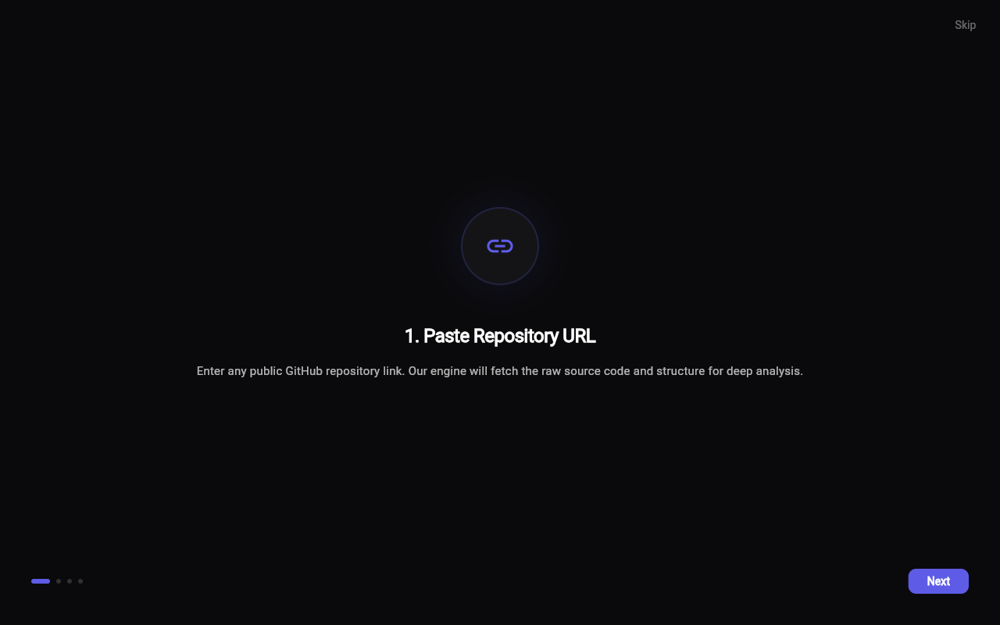
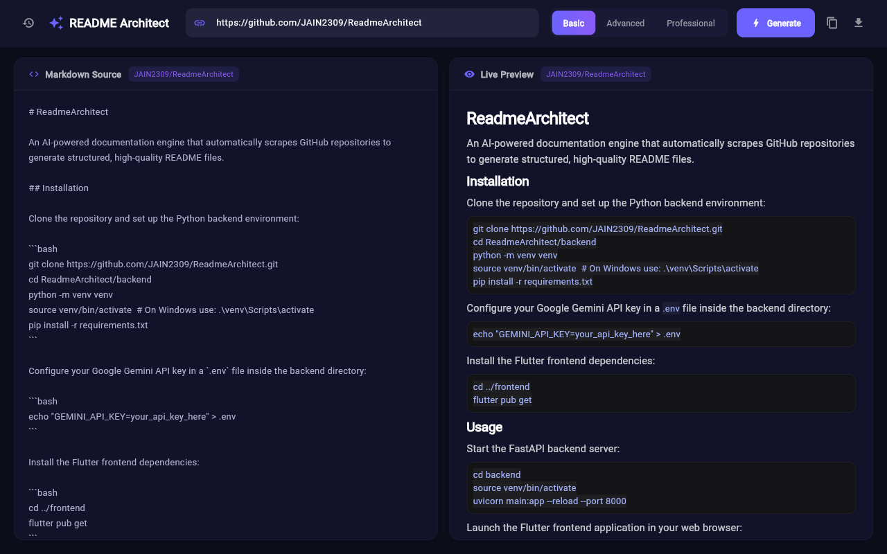
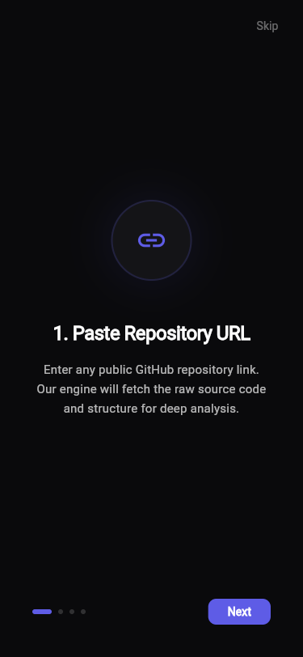
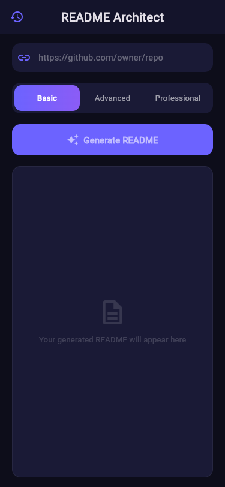
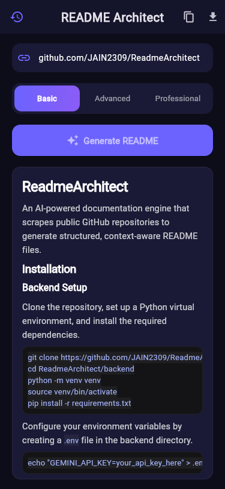

---

<div align="center">

A **production-grade AI documentation engine** connecting developers with automated, picture-perfect README generation — built with speed, intelligence, and modern design at its core.

<br/>


<br/>
<br/>

[](https://jain2309.github.io/ReadmeArchitect/)
[](https://readmearchitect.onrender.com/health)

</div>

---

## 📑 Table of Contents
- [✨ Features](#-features)
- [📸 App Screenshots](#-app-screenshots)
- [🛠 Tech Stack](#-tech-stack)
- [📂 Project Structure](#-project-structure)
- [🚀 Getting Started](#-getting-started)
- [🧠 AI Architecture](#-ai-architecture)
- [🔌 API Endpoints](#-api-endpoints)
- [⭐ Presentation Modes](#-presentation-modes)
- [🧪 Testing](#-testing)

---

## ✨ Features
<table>
<tr>
<td width="33%" valign="top">

### 🤖 AI Engine & Cloud Security
- **Deep Source Scraping** via GitHub Trees API (recursive file tree)
- **Deep File Content Fetching** — downloads up to 5 key files (10k chars each) for richer AI context
- **Repo Metadata Extraction** — scrapes description, stars, license, primary language, and default branch
- Automatic detection of `package.json`, `main.py`, `pubspec.yaml`, `Dockerfile`, `Cargo.toml`, `go.mod`, and more
- **Context-Aware Inference** using Gemini 3.5 Flash
- Pinned temperature (`0.2`) for deterministic markdown output
- **Firebase Bearer ID Token Verification** — FastAPI middleware cryptographically verifies signed Bearer tokens on protected endpoints
- **Firebase Cloud Firestore Store** — Realtime NoSQL document storage (`users/{session_id}/history`) with permanent 24/7 security rules
- **GitHub URL Validation** via Pydantic field validators
- **Global Rate Limiting** — IP-based API throttling (5 req/min) via SlowAPI

</td>
<td width="33%" valign="top">

### 💻 Desktop/Web Frontend
- **1-Click Google & Social Auth** — Sign In with Google popup flow (`signInWithPopup`), Email/Password, or Guest Session inside redesigned glassmorphism `AuthDialog`
- **FlutterFire Integration** — `Firebase.initializeApp(options: DefaultFirebaseOptions.currentPlatform)` initializing app state on launch
- **Gated README Generation** — prompts sign-in modal if user is unauthenticated
- **Vertical Icon Sidebar** — quick access to History, Badges, Copy, PR creation, and File Export
- **Line-Numbered Source Editor** — full line-numbered gutter with raw Markdown editing
- **Live Preview Pane** — real-time rendered preview with live `● SYNCING` indicator
- **Direct GitHub Integration** — push generated READMEs directly via Pull Request using Personal Access Tokens
- **Interactive Badge Selector** — inject live Shields.io badges (License, Stars, Forks, etc.)
- **Responsive Settings & Profile** — user account avatar, token visibility toggle, and ThemeMode controls
- **Enhanced History Panel** — search bar filter, date grouping (Today, Yesterday, etc.), and quick action card buttons (View, Copy, Download, Delete)

</td>
<td width="33%" valign="top">

### 📱 Native Mobile Frontend
- Single-column, thumb-friendly vertical scroll layout
- **Firebase Authentication Engine** — 1-Click Google Sign-In, Email Sign-In / Registration, and Guest Session mode
- **Segmented Edit / Preview Toggle** — switch seamlessly between Editor and Rendered Preview
- **Quick Action Bottom Bar** — one-tap Copy, PR creation, and File Export
- **Direct GitHub Integration** — push your README directly via PR from your phone
- **Custom App Icon & Splash** — dark navy/charcoal logo with native Android 12+ splash support
- **5-Step Onboarding Walkthrough** — card-based tour with feature highlights
- **Drawer-based History Panel** accessible via AppBar icon
- Delete individual entries or **clear all** with modal confirmation
- **Android Gradle Plugin 8.9.1 & Kotlin 2.2.20** — updated build chain with full AndroidX compatibility

</td>
</tr>
</table>

### 🎬 Shared Experience
- **Firebase Security & Auth Engine** — Cryptographically signed Bearer ID Token header verification + 1-Click Google Sign-In + Permanent Firestore Security Rules.
- **App Theming Engine** — dynamically built supporting Slate Light (`#F8FAFC`), Zinc Dark (`#09090B`), and System Auto modes.
- **Animated Splash Screen** — 6-stage staggered entrance with custom app branding.
- **5-Step Interactive Onboarding** — Paste URL → Select Mode → Preview → GitHub PR → Export/History.
- **Responsive Platform Routing** — auto-routes to Mobile or Desktop layout based on screen width and device capabilities.

---

## 🛣️ Upcoming Features (Roadmap)
While the core experience is highly polished, the following features are planned for future updates:
- **GitHub OAuth2 Login:** Replace Personal Access Tokens (PATs) with a seamless "Sign in with GitHub" web flow.
- **Private Repository Support:** Allow the AI to scrape and generate documentation for private enterprise repositories.
- **Custom Badge Support:** Let users input custom Shields.io URLs in the Badge Selector.
- **Pre-Commit Hook Integrations:** Provide a CLI tool that syncs the generated README into a local Git workflow.
- **Expanded Tech Stack Detection:** Deeper scraping support for Monorepos and lesser-known build tools.

---

## 📸 App Screenshots

### 🖥️ Desktop / Web Dashboard
<p align="center">
  
  
</p>

### 📱 Mobile UI Layout
<p align="center">
  
  
  
</p>

---

## 🛠 Tech Stack

<details open>
<summary><b>⚙️ Backend (Python / FastAPI)</b></summary>

| Technology | Purpose |
|-----------|---------|
| **Python 3.11+** | Runtime environment |
| **FastAPI** | High-performance async web framework |
| **Uvicorn** | ASGI server (`--reload` for dev) |
| **google-genai** | Direct integration with Gemini 3.5 Flash via Google GenAI SDK |
| **firebase-admin** | Admin SDK connecting to Cloud Firestore & Bearer ID Token verification |
| **HTTPX** | Fully asynchronous HTTP client for GitHub API scraping & raw file fetching |
| **Pydantic** | Strict data validation, payload serialization, and GitHub URL field validators |
| **python-dotenv** | Environment variable management (`.env` file loading) |
| **SlowAPI** | In-memory IP-based rate limiting to protect the Gemini API quota |
| **SQLite3** | Automatic local database fallback for development |

</details>

<details open>
<summary><b>📱 Frontend (Flutter / Dart)</b></summary>

| Technology | Purpose |
|-----------|---------|
| **Flutter 3.x** | Cross-platform UI toolkit (Web, Desktop, Mobile) |
| **firebase_core** | Firebase core SDK initialized with `DefaultFirebaseOptions.currentPlatform` |
| **cloud_firestore** | Realtime document storage SDK for fetching & saving user history |
| **firebase_auth** | User authentication engine (1-Click Google popup, Email/Password, Guest mode) |
| **google_sign_in** | Native 1-Click Google Sign-In SDK integration |
| **flutter_markdown** | Live rendering of AI-generated markdown strings with custom styled sheets |
| **flutter_secure_storage** | Native Keystore/Keychain encryption for storing GitHub Personal Access Tokens (PAT) securely |
| **universal_html** | Web-based file downloads (Blob + AnchorElement) and browser user-agent detection for platform routing |
| **http** | HTTP client connecting to the FastAPI backend with dynamic Bearer headers |
| **uuid** | Generates unique session identifiers for isolated backend history |
| **flutter_launcher_icons** | Automated multi-density Android mipmap & Web PWA icon generator |
| **flutter_native_splash** | OS-level Android 12+ and legacy launch splash screen orchestrator |
| **Slate & Zinc Theme System** | Custom modern design system — Slate light (`#F8FAFC`), Zinc dark (`#09090B`), vibrant blue accent (`#3B82F6`), line-numbered editor, elevated segmented controls |

</details>

---

## 📂 Project Structure

```text
readme_architect/
├── 📄 README.md                   # Project documentation
├── 📄 ROADMAP.md                  # Setup & run guide with troubleshooting
├── 📄 LICENSE                     # MIT License
├── 📁 readme_assets/              # Screenshots and visual branding assets
│
├── 📁 backend/
│   ├── main.py                    # FastAPI app entry point & router attachment
│   ├── routes/                    # API endpoints with Bearer Token verification
│   ├── services/                  # Core business logic (Scraping, LLM, PR creation)
│   ├── models/                    # Pydantic schemas (Request/Response models)
│   ├── store.py                   # Cloud Firestore store & SQLite fallback
│   ├── requirements.txt           # Python dependencies (includes firebase-admin)
│   ├── .env.example               # Environment template (GEMINI_API_KEY, FIREBASE_SERVICE_ACCOUNT_JSON)
│   └── .gitignore                 # Excludes venv, .env, __pycache__
│
└── 📁 frontend/
    ├── assets/
    │   └── app_icon.png          # Master 1024x1024 app icon asset
    ├── lib/
    │   ├── main.dart                    # App entry point, Firebase.initializeApp config
    │   ├── firebase_options.dart        # Auto-generated FlutterFire platform configuration
    │   ├── models/
    │   │   └── history_entry.dart        # History data model with flexible ID types
    │   ├── screens/
    │   │   ├── splash_screen.dart        # 6-stage animated startup sequence
    │   │   ├── onboarding_screen.dart    # 5-step interactive card-based walkthrough
    │   │   ├── desktop_screen.dart       # Sidebar + line-numbered split-pane view
    │   │   └── mobile_screen.dart        # Segmented view with bottom quick actions
    │   ├── services/
    │   │   ├── api_service.dart          # HTTP client to backend (generate + history CRUD)
    │   │   ├── auth_service.dart         # Firebase Auth engine & Guest mode manager
    │   │   └── export_service.dart       # Web download (Blob) / Clipboard fallback logic
    │   ├── theme/
    │   │   ├── app_theme.dart            # Slate & Zinc design system definitions
    │   │   └── theme_provider.dart       # Light, Dark & System ThemeMode persistence
    │   ├── utils/
    │   │   └── platform_detector.dart    # Responsive routing (Mobile vs Web/Desktop)
    │   └── widgets/
    │       ├── history_panel.dart        # Date-grouped history with search & card action buttons
    │       ├── badge_selector.dart       # Interactive badge selector UI
    │       └── shared/                   # Shared UI components
    │           ├── auth_dialog.dart      # Responsive Email/Password, 1-Click Google & Guest auth modal
    │           ├── url_input_field.dart  # Reusable GitHub URL input text field
    │           ├── mode_selector.dart    # Elevated segmented presentation mode toggle
    │           ├── generate_button.dart  # Primary action button with loading states
    │           └── settings_dialog.dart  # Responsive settings dialog / bottom sheet
    └── pubspec.yaml
```

---

## 🚀 Getting Started

### Prerequisites
> [Flutter SDK](https://docs.flutter.dev/get-started/install) · [Python 3.11+](https://www.python.org/downloads/) · [Google Gemini API Key](https://aistudio.google.com/apikey) · [Firebase Account](https://console.firebase.google.com)

### 1️⃣ Clone the repository
```bash
git clone https://github.com/JAIN2309/ReadmeArchitect.git
cd ReadmeArchitect
```

### 2️⃣ Backend Setup
Navigate to the backend directory and set up the Python environment:
```bash
cd backend
python -m venv venv

# Windows
.\venv\Scripts\activate
# Mac/Linux
source venv/bin/activate

pip install -r requirements.txt
```

Create a `.env` file in the `backend/` directory:
```env
GEMINI_API_KEY=your_gemini_api_key_here
FIREBASE_SERVICE_ACCOUNT_JSON=your_firebase_service_account_json_content_here
```
> 💡 **Get Keys:** Generate Gemini Key at [Google AI Studio](https://aistudio.google.com/app/apikey) and Firebase Private Key at [Firebase Console Settings](https://console.firebase.google.com).

Start the backend server:
```bash
uvicorn main:app --reload --port 8000
```

### 3️⃣ Frontend Setup
Open a new terminal window and navigate to the frontend directory:
```bash
cd frontend
flutter pub get
```

Configure Firebase options using FlutterFire CLI:
```bash
flutterfire configure
```

Run the application on Desktop Web (Chrome):
```bash
flutter run -d chrome
```

---

## 🧠 AI Architecture

The engine doesn't just guess what your project does based on the name. It actively scrapes the source code.

```text
┌──────────────────────────────────┐   ┌──────────────────────────────────────────┐
│  1️⃣ GitHub Scraper                │   │  2️⃣ Gemini 3.5 Flash Inference           │
│     Resolves default branch       │   │     Analyzes tech stack & dependencies   │
│     Fetches recursive file tree   │   │     Applies specific "Presentation Mode" │
│     Scrapes repo metadata         │ ──→     Returns structured raw Markdown      │
│     (stars, license, language)    │   │                                          │
│     Downloads top 5 key files     │   │     System instruction per mode          │
│     (10k chars each for context)  │   │     Pinned temperature = 0.2             │
└──────────────────────────────────┘   └──────────────────────────────────────────┘
```

---

## 🔌 API Endpoints

All endpoints are served by the FastAPI backend at `http://localhost:8000`.

| Method | Endpoint | Description | Request Body |
|--------|----------|-------------|-------------|
| `POST` | `/api/auto-readme` | Generate a README for a public GitHub repo | `{ "github_url": "https://github.com/owner/repo", "presentation_mode": "Basic" \| "Advanced" \| "Professional" }` |
| `GET` | `/api/history` | Fetch all past Cloud Firestore generations for the user | — |
| `DELETE` | `/api/history/{entry_id}` | Delete a single history document by ID | — |
| `DELETE` | `/api/history` | Clear all history entries for the user | — |
| `GET` | `/health` | Health check | — |

---

## 🌟 Featured Portfolio Projects

| Project | Description | Live Frontend | Live Backend | Stack |
| :--- | :--- | :--- | :--- | :--- |
| **README Architect** | AI-powered documentation engine connecting developers with automated, picture-perfect README generation. | 🌐 [Live Demo](https://jain2309.github.io/ReadmeArchitect/) | ⚙️ [FastAPI Service](https://readmearchitect.onrender.com/health) | Flutter · Dart · FastAPI · Gemini AI · Firebase |
| **FoodBridge MERN** | Full-stack real-time food rescue platform connecting donors with NGOs to minimize food waste. | 🌐 [Live App](https://jain2309.github.io/foodbridgemern/) | ⚙️ [API Service](https://foodbridgemern.onrender.com) | React · Node.js · Express · MongoDB · Redis |

---

## 👤 Author
**Krish Jain**

[](https://github.com/JAIN2309)
[](mailto:krishjain641@gmail.com)
[](https://github.com/JAIN2309/ReadmeArchitect)

<br/>

*Architecting the future of documentation.* 📝
